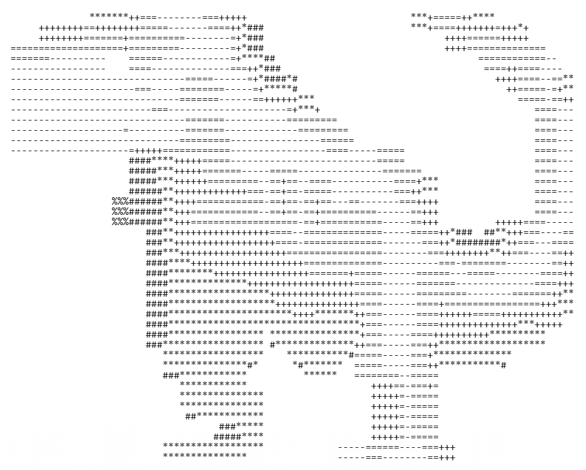

# chromedino

## Description
This solution is a didactical application for C# learning. 
It simulates the T-Rex Chrome Dino Game at the scoreboards (LED matrix screens). 
Whenever there is an obstacle the Dino has to jump over it, otherwise the game is over. 

## Controls
<pre>
SPACE / ENTER       - start / restart game 
ARROW_UP            - jump 
1, 2, 3, 4          - change difficulty to EASY, NORMAL, HARD or IMPOSSIBLE
</pre>

## Features
- Score:              counting how long you last in seconds
- Endless Mode:       never run out of obstacles to jump over
- Physics:            jump up and down with simulated gravity and y-axis acceleration
- Difficulty:         obstacles leave you time to react at first but move faster than before
- Highscores:         saving the highest score for each difficulty even after closing the game
- Advanced Graphics:  dino bleeds when it runs against a wall
- Graphical Starting Screen
